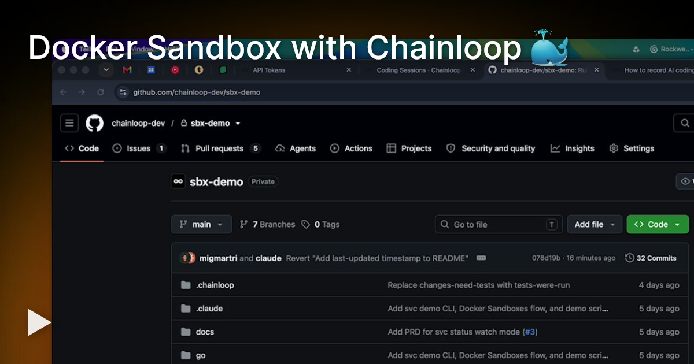
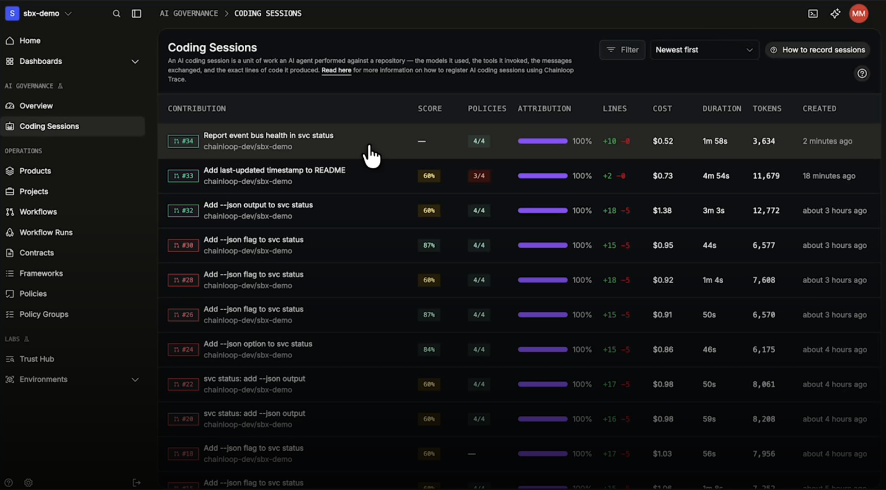
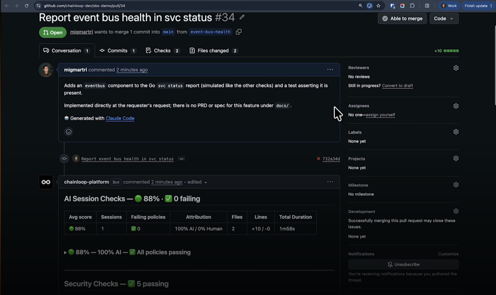
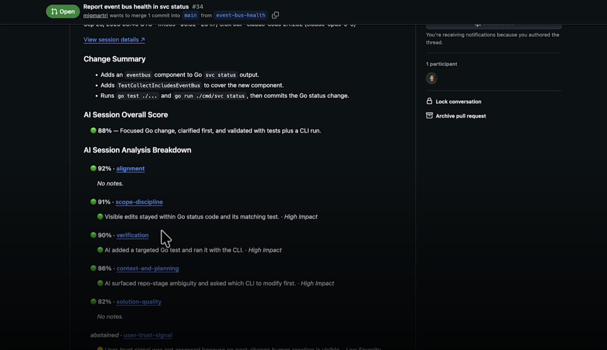
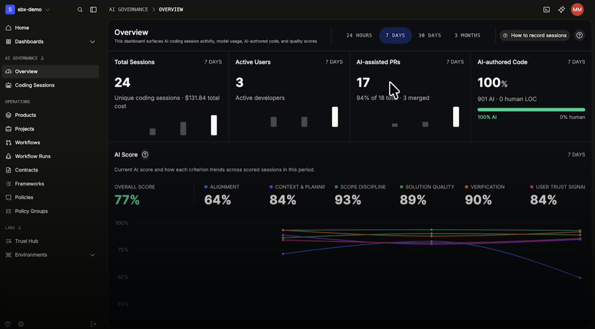
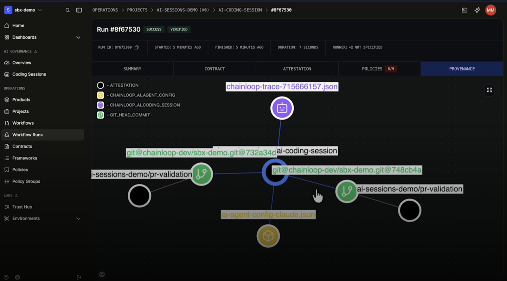

# sbx-demo

> ⭐ **Chainloop is open source.** If this demo is useful to you, please
> [star chainloop-dev/chainloop on GitHub](https://github.com/chainloop-dev/chainloop). It helps other people find it.

A small, self-contained repository for demonstrating **AI coding sessions that produce
evidence**. You give a coding agent a task inside a [Docker Sandbox](https://docs.docker.com/ai/sandboxes/);
the session is recorded, signed, and checked against policy by
[Chainloop](https://docs.chainloop.dev); the verdict shows up as a check on the pull request.

The code the agent works on is deliberately tiny — a CLI called `svc` — so the interesting
part is the workflow around it, not the program.

For the product side of AI coding sessions, see
[chainloop.dev/ai-sessions](https://chainloop.dev/ai-sessions).

## Watch the demo

[](https://www.tella.tv/video/docker-sandbox-with-chainloop-19bf)

A coding agent in a Docker Sandbox picks up an issue, opens the pull request, and works
through its checks, with every step recorded as signed evidence in Chainloop.

---

## Quickstart

### 1. Prerequisites

| You need | Why |
|---|---|
| [`sbx`](https://docs.docker.com/ai/sandboxes/) + a running `sandboxd` | Runs the agent in an isolated sandbox |
| A Chainloop account and an **org-scoped** API token | Receives the signed session evidence |
| `gh` (GitHub CLI), authenticated | Opening and inspecting pull requests |
| Node.js >= 20 *or* a Go toolchain | Only if you want to run `svc` yourself |

### 2. Configure your token

```bash
cp .env.example .env
# edit .env:  chainloopToken=<your Chainloop API token>
```

`.env` is git-ignored. The token is **org-scoped**, and `.chainloop.yml` pins this repo to
the `sbx-demo` organization — a token from a different org is rejected when the attestation
is pushed.

### 3. Start the agent

```bash
sbx run --clone --kit-args-file .env chainloop/sbx-kit-claude
```

Claude Code starts inside the sandbox and confirms that recording is on:

```
Chainloop Trace is recording this session. Evidence will be sent to https://app.chainloop.dev
```

### 4. Give it a task

```
In node/, add a --json flag to svc status. Cover it with a test, commit, and push.
```

---

## What happens when the agent pushes

1. The agent commits and runs `git push`.
2. A **pre-push hook** signs the recorded session and sends it to Chainloop as a
   `CHAINLOOP_AI_CODING_SESSION` attestation.
3. Chainloop evaluates it against the policies in `.chainloop/policies/`.
4. The pull request gets an **AI Session Checks** comment and a `Chainloop PR Validation` check.
5. The session opens in Chainloop with the full transcript, every tool and MCP call,
   per-file AI-vs-human attribution, cost, and a score.

Check the result of the most recent run from the command line:

```bash
chainloop workflow run list --project sbx-demo -o json | jq -r '.[0] | "\(.policyStatus) \(.id)"'
```

If it is not `passed`, list the violations:

```bash
chainloop workflow run describe --id <id> -o json | jq -r '
  .attestation.policy_evaluations | to_entries[] | .key as $s | .value[]
  | select((.violations // []) | length > 0) | "\($s) \(.name)", (.violations[] | "   \(.)")'
```

---

## The `svc` CLI

`svc status` reports the health of a service's components. The checks are **simulated**, so
the demo has no external dependencies and no network access is required.

```
$ svc status
checked at 2026-09-24T09:15:00.000Z
COMPONENT  STATUS LATENCY  DETAIL
api        ok     12ms     200 OK
database   ok     3ms      connections 4/50
queue      ok     8ms      depth 0
```

Exit codes: `0` all components healthy, `1` at least one failing, `2` unknown command.

The same CLI is implemented twice, once in Node and once in Go. **Pick one and work only in
it** — a task names the language it wants.

```bash
# Node (>= 20, no dependencies to install)
cd node && node bin/svc.js status   # or: npm run status
cd node && npm test

# Go
cd go && go run ./cmd/svc status
cd go && go test ./...
```

Always build and test before reporting a change as done.

---

## Demo scripts

| Script | What it does |
|---|---|
| `scripts/demo-reset.sh` | Back to a clean state: removes `demo-*` sandboxes and branches, cleans the tree. `--hard` also drops the persistent `~/.claude` volumes for a true first-run experience. |
| `scripts/demo-test.sh` | Runs the whole loop unattended, with assertions: opens an issue, and the agent implements it, opens the PR and works through its checks. `--narrate` makes it presentation-friendly: it shows each command, the agent's steps live, and pauses between stages. |

---

## How work is split: three stages, three sessions

A feature moves through three directories, in order, and **each stage is its own session and
its own pull request**:

| Stage | Lives in | Contains |
|---|---|---|
| 1. Intent | `docs/prds/` | Context, problem, summary, notes. No design. |
| 2. Design | `docs/specs/` | CLI surface, behaviour, exit codes, what to test. No code. |
| 3. Implementation | `node/` or `go/` | The code and its tests. |

One number ties them together, e.g. `001-watch-flag` is the same feature in each stage.
Stage N reads what stage N-1 merged; it never rewrites it.

Three policies enforce this, and a failing one blocks the PR check:

- **`session-stays-in-one-stage`** — a session that edits a PRD while implementing it has
  rewritten the requirement to match the code.
- **`prd-no-implementation-detail`** — an AI reviewer checks that PRDs contain no flags,
  schemas, endpoints, file names, or acceptance criteria.
- **`tests-were-run`** — a diff can show that test files changed; only the recorded session
  shows whether the tests were actually executed.

---

## What it looks like

**Every AI coding session in one list.** Each pull request shows its AI Session Score, how many
policies passed, how much of the code the AI wrote, lines changed, cost, duration, and tokens.



**The verdict lands on the pull request.** Chainloop comments with the session's score, failing
policies, AI-versus-human attribution, and a link to the full session, so reviewers never leave GitHub.



**A score with reasons.** The AI Session Score breaks down into criteria (alignment, scope
discipline, verification, context and planning, solution quality), each with a short finding.



**The organization-wide view.** Sessions, active developers, AI-assisted pull requests and how
much of the code AI wrote, plus how each score criterion trends over time.



**Provenance you can follow.** The signed attestation links the commit to the session transcript,
the agent's configuration, and the pull request validation runs. `chainloop discover` walks the
same graph from the command line.



---

## Learn more

- [Chainloop open source](https://github.com/chainloop-dev/chainloop): the evidence store and policy engine
- [AI coding sessions](https://chainloop.dev/ai-sessions): governing AI-written code with Chainloop
- [Docker Sandboxes guide](https://docs.chainloop.dev/guides/docker-sandboxes): the full setup this demo follows
